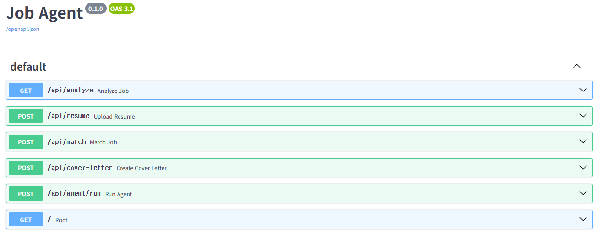
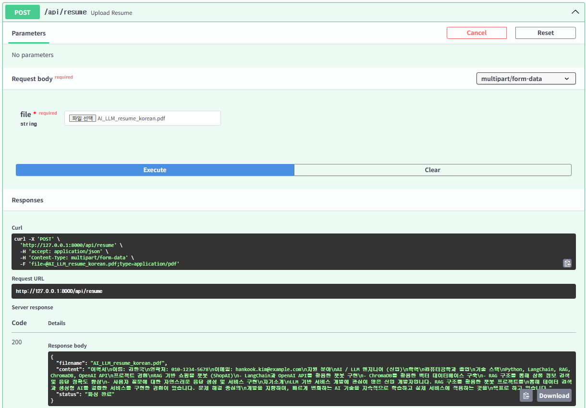
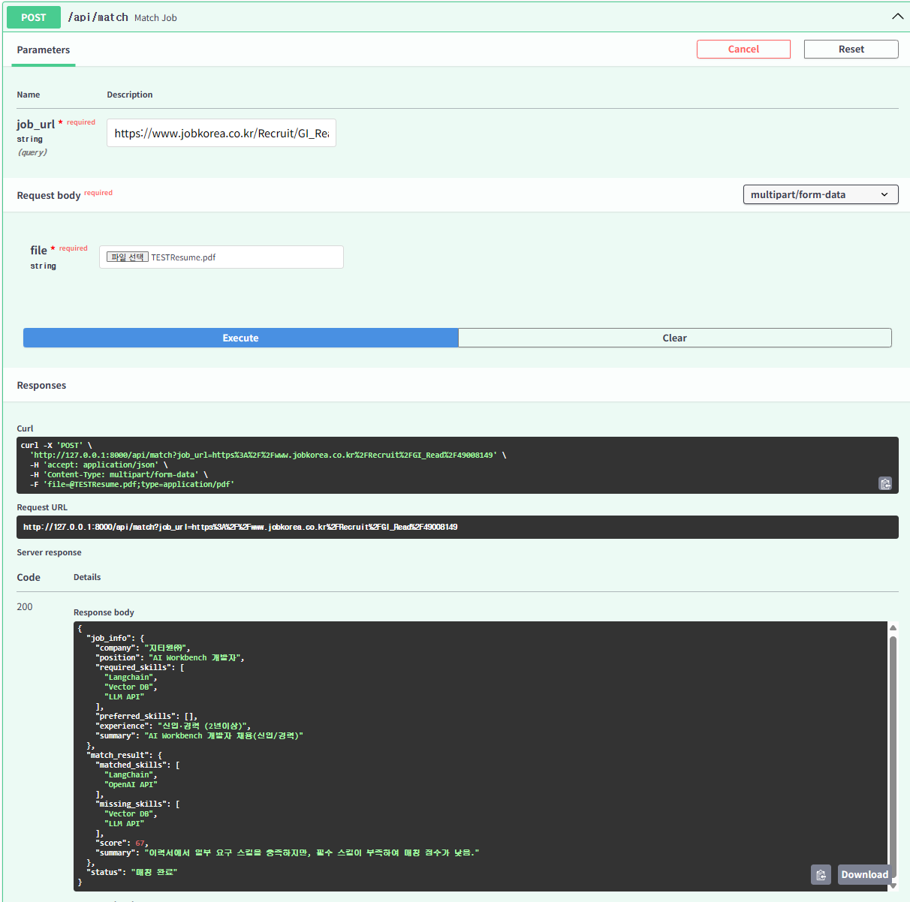
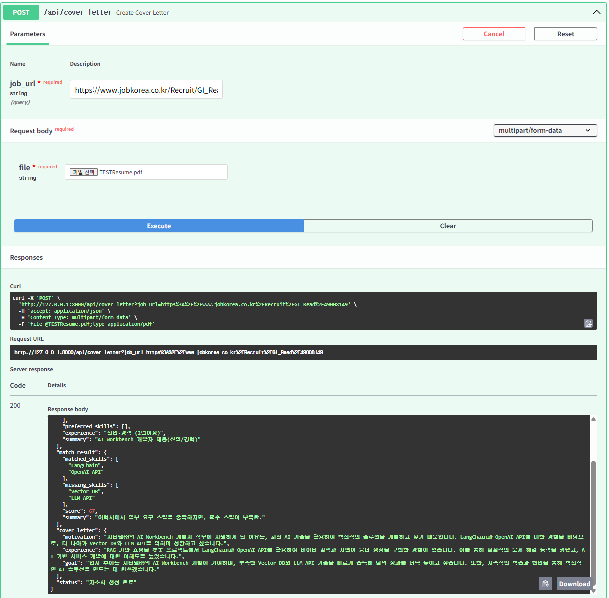
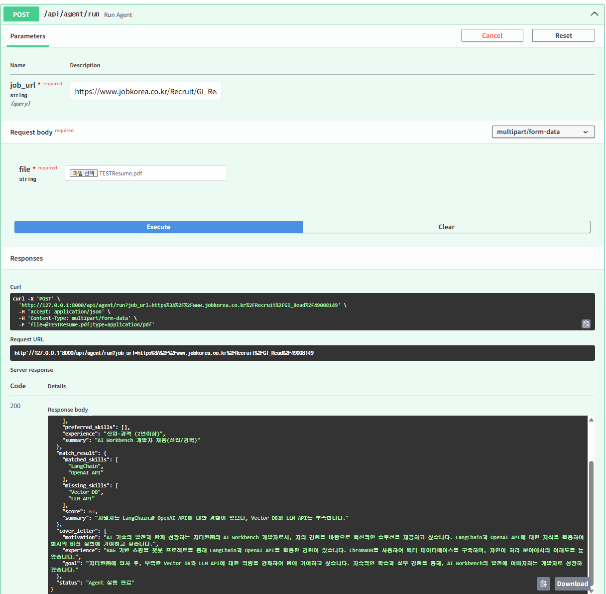
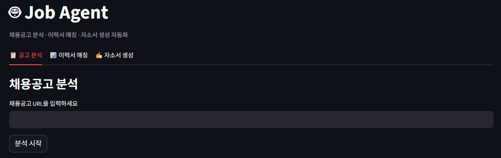
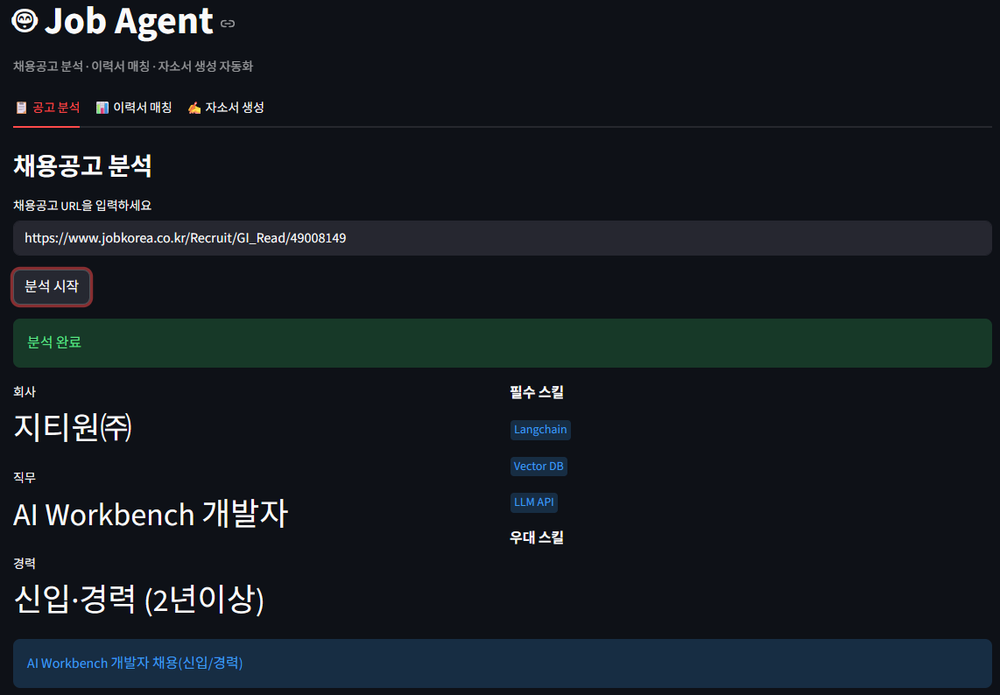
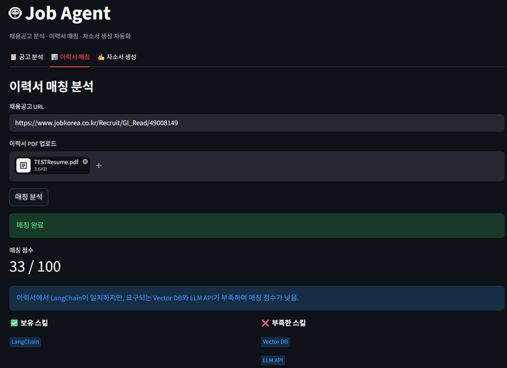
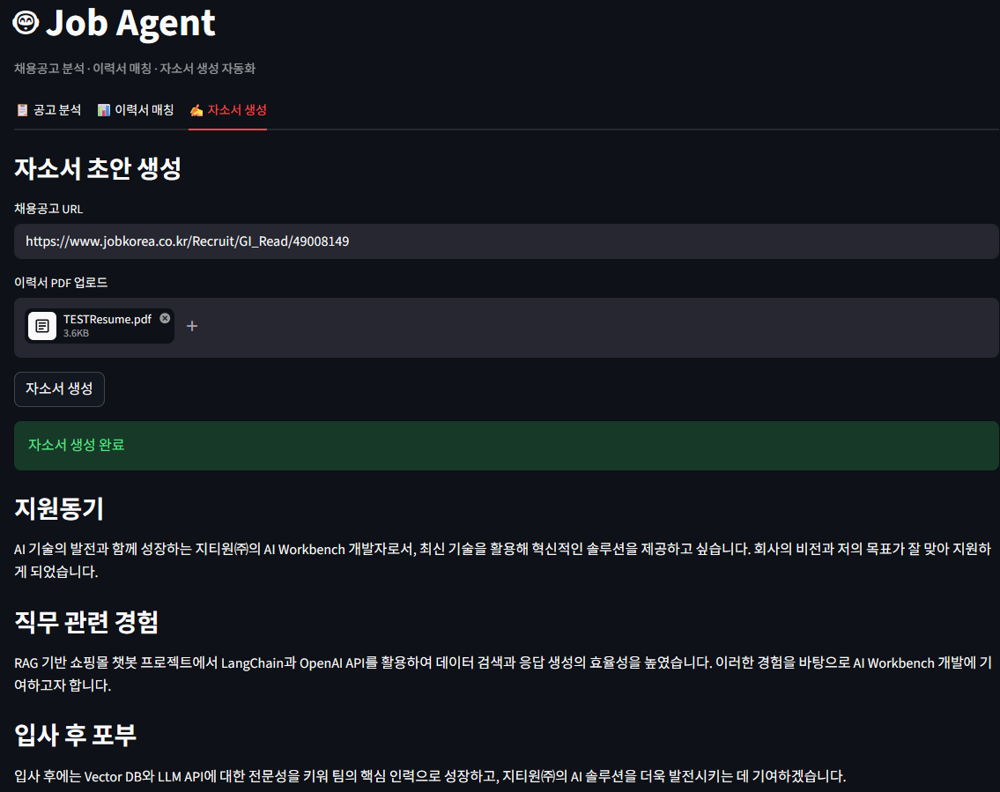
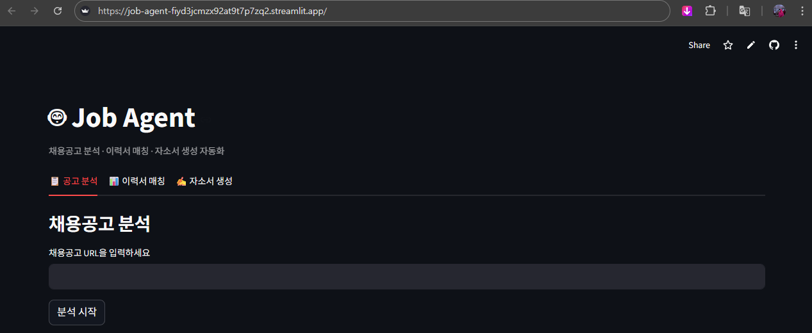

# 🤖 Job Agent — AI 기반 채용공고 분석 Agent

> LangGraph 기반 채용공고 분석 · 이력서 매칭 · 자소서 생성 자동화 서비스

🚀 라이브 데모: https://job-agent-fiyd3jcmzx92at9t7p7zq2.streamlit.app/

> ⚠️ **배포 이슈 기록 (2026.04.22)**
>
> **[수정 완료] 환경변수 읽기 오류**
> 배포 후 라이브 데모 접속 시 `OPENAI_API_KEY`를 읽지 못하는 문제가 발생했습니다. 로컬에서는 `.env`로 동작하지만 Streamlit Cloud는 `st.secrets`로 읽어야 하는 차이 때문이었습니다. `os.getenv()` → `st.secrets` 폴백 방식으로 수정하여 해결했습니다.
>
> **[미해결] 잡코리아 크롤링 차단**
> Streamlit Cloud 서버 IP가 잡코리아에서 차단되어 배포 환경에서는 잡코리아 공고 분석이 동작하지 않습니다. 로컬 환경에서는 정상 동작합니다. 원티드, 사람인 등 다른 플랫폼은 배포 환경에서도 정상 동작합니다. v2에서 User-Agent 설정 강화 또는 크롤링 라이브러리 교체로 개선할 예정입니다.

---

## 프로젝트 개요

채용공고 URL과 이력서 PDF를 입력하면, AI Agent가 자동으로 공고를 분석하고 이력서와 비교해서 자소서 초안까지 생성해주는 서비스입니다.

이전 프로젝트인 ShopAI(RAG 기반 챗봇)에서 단순 검색→답변 구조를 넘어, 여러 단계를 스스로 판단하고 실행하는 Agent 구조를 직접 설계하고 싶어서 시작했습니다.

---

## 주요 기능

**1. 채용공고 분석**
채용공고 URL을 입력하면 웹 크롤링 후 GPT-4o-mini가 회사명, 직무, 필수 스킬, 우대사항, 경력 요건을 자동 추출합니다.

**2. 이력서 매칭**
이력서 PDF를 업로드하면 채용공고와 비교해서 보유 스킬, 부족한 스킬, 매칭 점수(0~100)를 산출합니다.

**3. 자소서 초안 생성**
이력서와 공고 분석 결과를 바탕으로 지원동기, 직무 관련 경험, 입사 후 포부 초안을 자동 생성합니다.

---

## 기술 스택

| 분류 | 기술 |
|---|---|
| 언어 | Python 3.11 |
| LLM | GPT-4o-mini |
| Agent | LangGraph |
| 백엔드 | FastAPI |
| 크롤링 | httpx, BeautifulSoup4 |
| PDF 파싱 | PyMuPDF (fitz) |
| UI | Streamlit |
| 배포 | Streamlit Cloud |

---

## 주요 화면

> 📌 아래 스크린샷은 로컬 환경에서 촬영한 테스트 결과입니다.

### 1. API 엔드포인트 (Swagger UI)

FastAPI로 구현한 엔드포인트 목록입니다. `/api/analyze`, `/api/resume`, `/api/match`, `/api/cover-letter`, `/api/agent/run` 총 5개의 API를 설계했습니다.

---

### 2. 이력서 PDF 파싱

PyMuPDF로 PDF에서 텍스트를 추출합니다. 한글 이력서도 정상적으로 파싱됩니다.

---

### 3. 이력서 매칭 결과 (Swagger UI)

채용공고와 이력서를 비교해서 매칭 스킬, 부족한 스킬, 점수를 반환합니다.

> 💡 **매칭 점수 일관성 이슈**
> 동일한 이력서와 공고로 테스트했을 때 67점과 33점이 각각 나왔습니다. `temperature=0`으로 설정했음에도 GPT가 크롤링된 공고 텍스트를 매번 조금씩 다르게 해석하기 때문입니다. 이는 입력 텍스트의 노이즈(메뉴, 광고 등 불필요한 HTML 잔재)가 원인일 가능성이 높습니다. v2에서 텍스트 전처리를 강화하고 정량 평가 지표를 추가해서 개선할 예정입니다.

---

### 4. 자소서 생성 결과 (Swagger UI)

지원동기, 직무 관련 경험, 입사 후 포부를 자동 생성합니다.

> 💡 **자소서 길이 설정**
> 현재 자소서 초안은 테스트 목적으로 200자 내외로 설정했습니다. v2에서 500자 이상으로 늘리고 사용자가 직접 포맷을 입력하면 그에 맞게 초안을 작성하는 커스터마이징 기능을 추가할 예정입니다.

---

### 5. LangGraph Agent 실행 결과

`/api/agent/run` 하나로 크롤링 → 분석 → 매칭 → 자소서 생성까지 전체 파이프라인이 자동 실행됩니다.

---

### 6. Streamlit UI 초기 화면

3개 탭으로 구성된 Streamlit 인터페이스입니다.

---

### 7. 공고 분석 결과

채용공고 URL만 입력하면 회사, 직무, 필수 스킬, 우대사항을 자동으로 추출합니다.

---

### 8. 이력서 매칭 결과

이력서 PDF를 업로드하면 공고와 비교해서 매칭 점수와 갭 분석 결과를 보여줍니다.

---

### 9. 자소서 생성 결과

공고와 이력서를 분석해서 자소서 초안 3개 항목을 자동 생성합니다.

---

### 10. 배포 화면

Streamlit Cloud에 배포된 서비스입니다.

---

## 개발 과정

### Step 1 — FastAPI 백엔드 + 핵심 기능 구현

채용공고 크롤링, GPT 분석, 이력서 매칭, 자소서 생성을 FastAPI 엔드포인트로 각각 구현했습니다.

`/api/analyze` → `/api/match` → `/api/cover-letter` 순서로 기능을 단계적으로 쌓았고, Swagger UI로 각 엔드포인트를 테스트했습니다.

### Step 2 — LangGraph Agent 연결

각 엔드포인트를 독립적으로 호출하는 구조에서, LangGraph로 전체 파이프라인을 하나의 그래프로 연결했습니다.

크롤링 → 분석 → 매칭 → 자소서 생성 순서를 노드와 엣지로 설계하고, `/api/agent/run` 하나로 전체 흐름을 실행할 수 있게 했습니다.

ShopAI에서 LangChain으로 RAG 파이프라인을 구성했다면, 이번엔 LangGraph로 상태 기반 Agent를 직접 설계한 것이 핵심 차이입니다. LangChain은 정해진 순서대로만 실행되지만, LangGraph는 상태를 공유하며 조건에 따라 흐름을 제어할 수 있습니다.

### Step 3 — Streamlit 단독 구조로 전환 및 배포

초기에는 FastAPI 백엔드와 Streamlit 프론트를 분리했지만, Streamlit Cloud 배포 시 백엔드 서버를 별도로 띄울 수 없는 구조적 문제가 있었습니다.

배포 복잡도를 낮추고 단일 파일로 관리하기 위해 FastAPI 의존성을 제거하고 Streamlit 안에서 직접 처리하는 구조로 전환했습니다. 배포 후에는 환경변수 읽기 오류와 잡코리아 크롤링 차단 문제를 추가로 발견하고 대응했습니다.

---

## 프로젝트 구조

```
job-agent/
├── app/
│   ├── main.py              # FastAPI 앱
│   ├── agent/
│   │   └── graph.py         # LangGraph Agent 그래프
│   ├── routers/
│   │   ├── analyze.py       # 공고 분석 엔드포인트
│   │   ├── resume.py        # 이력서 파싱 / 매칭 엔드포인트
│   │   └── job_agent.py     # Agent 실행 엔드포인트
│   └── services/
│       ├── crawler.py       # 웹 크롤링
│       ├── analyzer.py      # GPT 공고 분석
│       ├── resume_parser.py # PDF 파싱
│       ├── matcher.py       # 이력서 매칭
│       └── cover_letter.py  # 자소서 생성
├── frontend/
│   └── app.py               # Streamlit UI
├── images/                  # 스크린샷
└── requirements.txt
```

---

## 설치 및 실행

```bash
# 1. 환경 설정
conda create -n job_agent_env python=3.11
conda activate job_agent_env
pip install -r requirements.txt

# 2. API 키 설정
# .env 파일 생성 후 입력
OPENAI_API_KEY=sk-...

# 3. Streamlit 실행
streamlit run frontend/app.py
```

---

## 개발 인사이트

**RAG에서 Agent로**
ShopAI는 질문이 들어오면 검색하고 답변하는 단순 반복 구조였습니다. Job Agent는 목표를 주면 크롤링, 분석, 매칭, 자소서 생성을 스스로 순서대로 실행합니다. LangGraph의 상태 그래프를 직접 설계하면서 Agent와 단순 파이프라인의 차이를 실감했습니다.

**배포 구조가 설계에 영향을 준다**
FastAPI와 Streamlit을 분리했을 때 로컬에서는 잘 동작했지만, Streamlit Cloud 배포 시 백엔드를 띄울 수 없는 문제가 생겼습니다. 처음부터 배포 환경을 고려하고 아키텍처를 설계해야 한다는 점을 배웠습니다.

**배포 환경별 환경변수 처리**
로컬에서는 `.env`로 잘 동작하던 코드가 Streamlit Cloud에서는 `st.secrets`로 읽어야 하는 차이가 있었습니다. 배포 환경마다 환경변수 주입 방식이 다르다는 점을 직접 겪으면서 배웠습니다.

**크롤링 차단 이슈**
Streamlit Cloud 서버 IP가 잡코리아에서 차단되어 배포 환경에서는 동작하지 않는 문제를 발견했습니다. 로컬과 배포 환경의 네트워크 환경 차이를 고려하지 못한 부분이었습니다. v2에서 크롤링 방식을 개선하거나 지원 플랫폼을 명확히 안내하는 방향으로 해결할 예정입니다.

**매칭 점수 일관성 문제**
같은 입력에도 매칭 점수가 33점과 67점으로 다르게 나오는 문제를 발견했습니다. `temperature=0`으로 설정했음에도 크롤링 텍스트에 남아있는 HTML 잔재가 GPT의 해석에 영향을 주기 때문입니다. 단순히 모델 파라미터 문제가 아니라 입력 데이터 품질이 결과에 직접 영향을 준다는 점을 수치로 확인했습니다. v2에서 텍스트 전처리 강화와 정량 평가 지표 추가로 개선할 예정입니다.

---

## v2 예정 기능

- 사이드바 공통 입력으로 UX 개선
- 결과 기반 AI 상담 채팅 기능
- 자소서 길이 및 포맷 커스터마이징
- 프롬프트 실험 및 비교 결과
- 텍스트 전처리 강화 + 크롤링 개선
- 매칭 점수 정량 평가

---
